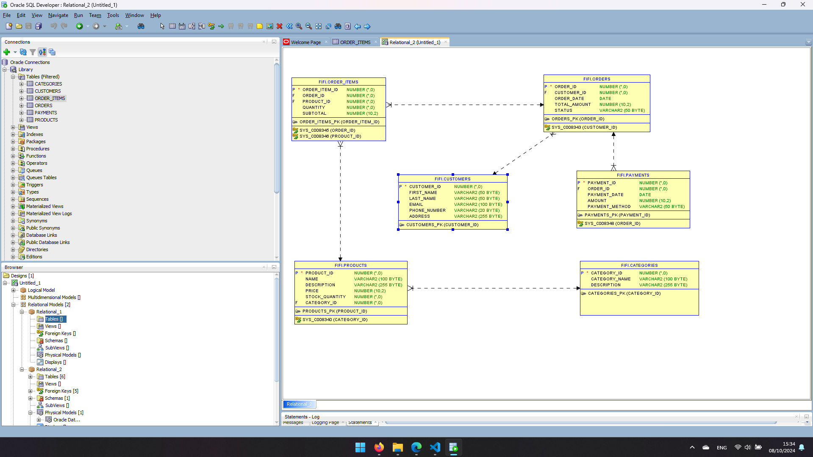

# Ecommerce Management Database (Using Oracle as RDBMS)

This README provides an overview of the Ecommerce Management Database, designed specifically for Oracle courses to manage and store information related to employees and organizational structure. It includes tables for Categories, Payments, Orders, Order_Times, Products and Customers records.

## Table Structures

### Categories Table

```sql
CREATE TABLE Categories (
    Category_ID NUMBER PRIMARY KEY NOT NULL,       -- Unique ID for each Category
    Category_Name VARCHAR2(100) NOT NULL,        -- Name for each Category
    Description VARCHAR2(255)            -- Description of each category 
);
```

## Products Table

```sql
CREATE TABLE Products (
    Product_ID NUMBER PRIMARY KEY NOT NULL,        -- Unique ID for each Product
    Name VARCHAR2(100) NOT NULL,                    -- Name for each Product
    Description VARCHAR2(255),             -- Description of each Product 
    Price DECIMAL(10, 2),                 -- Proce of each product with 10 numbers maximum and 2 numbers after the colon
    Stock_Quantity NUMBER,                -- Quantity of each product
    Category_ID,                          -- Foreign key referencing Category table
    FOREIGN KEY (Category_ID) REFERENCES Categories(Category_ID)  -- Establishing a relationship with the Category table
);

```

## Customers Table

```sql

CREATE TABLE Customers ( 
    Customer_ID NUMBER PRIMARY KEY,         -- Unique ID for each Customer
    First_Name VARCHAR2(50) NOT NULL,    -- Customer's first name     
    Last_Name VARCHAR2(50) NOT NULL,     -- Customer's last name    
    Email VARCHAR2(100) UNIQUE NOT NULL, -- Employee's email (must be unique)             
    Phone_Number VARCHAR2(20),            -- Employee's phone number
    Address VARCHAR2(255)                    -- Employee's address
);

```

## Orders Table

```sql
CREATE TABLE Orders (
    Order_ID NUMBER PRIMARY KEY UNIQUE NOT NULL,        -- Unique ID for each Order
    Customer_ID NUMBER,                                 -- Foreign key referencing Customers table
    Order_Date DATE,                                    -- Order's date
    Total_Amount DECIMAL(10, 2),                        -- Price of the total with 10 numbers maximum and 2 numbers after the colon
    Status VARCHAR2(50) CHECK (Status IN ('Completed', 'Pending', 'Aborted')),     -- Order status (Completed, Pending, Aborted)                           
    FOREIGN KEY (Customer_ID) REFERENCES Customers(Customer_ID)            -- Establishing a relationship with the Orders table
);
```

## Order_Items Table
```sql
CREATE TABLE Order_Items (
    Order_Item_ID NUMBER PRIMARY KEY,             -- Unique ID for each Order_Items
    Order_ID NUMBER,                              -- Foreign key referencing Orders table
    Product_ID NUMBER,                            -- Foreign key referencing Products table
    Quantity NUMBER,                              -- Numbers of products 
    Subtotal DECIMAL(10, 2),                      -- Price of the subtotal with 10 numbers maximum and 2 numbers after the colon
    FOREIGN KEY (Order_ID) REFERENCES Orders(Order_ID), -- Establishing a relationship with the Orders table
    FOREIGN KEY (Product_ID) REFERENCES Products(Product_ID) -- Establishing a relationship with the Products table
);
```

## Payments Table
```sql

CREATE TABLE Payments (
    Payment_ID NUMBER PRIMARY KEY UNIQUE NOT NULL,
    Order_ID NUMBER,            -- Foreign key referencing Orders table
    Payment_Date DATE,          -- Date of the payment 
    Amount DECIMAL(10, 2),      -- Amount of the Payment with 10 numbers maximum and 2 numbers after the colon
    Payment_Method VARCHAR2(4) CHECK (Payment_Method IN ('Cash', 'Card'),   -- Payment_Method (Cash, Card) 
    FOREIGN KEY (Order_ID) REFERENCES Orders(Order_ID)  -- Establishing a relationship with the Orders table
);

```

# Inserting Records

To insert records into the tables, you can use the following examples:

## Insert Categories

```sql
INSERT INTO Categories (Category_ID, Category_Name, Description) 
VALUES (1, 'Electronics', 'Devices and gadgets');

INSERT INTO Categories (Category_ID, Category_Name, Description) 
VALUES (2, 'Clothing', 'Men and women clothing');

INSERT INTO Categories (Category_ID, Category_Name, Description) 
VALUES (3, 'Shoes', 'Men and women shoes');
```

## Insert Products

```sql 
INSERT INTO Products (Product_ID, Name, Description, Price, Stock_Quantity, Category_ID) 
VALUES (100, 'Smartphone', 'Latest model', 599.99, 100, 1);

INSERT INTO Products (Product_ID, Name, Description, Price, Stock_Quantity, Category_ID) 
VALUES (200, 'T-shirt', 'Cotton T-shirt', 19.99, 500, 2);

INSERT INTO Products (Product_ID, Name, Description, Price, Stock_Quantity, Category_ID) 
VALUES (300, 'Shoes', 'NIKE', 199.99, 50, 3);
```
## Insert Customers

```sql
INSERT INTO Customers (Customer_ID, First_Name, Last_Name, Email, Phone_Number, Address) 
VALUES (10, 'Frederic', 'ALLOGHO', 'frederic@gmail.com', '0789 999 999', 'KK 182 St');

INSERT INTO Customers (Customer_ID, First_Name, Last_Name, Email, Phone_Number, Address)
VALUES (11, 'Richard', 'OYONO', 'richard@gmail.com', '0790 000 000', 'KK 14 St');

INSERT INTO Customers (Customer_ID, First_Name, Last_Name, Email, Phone_Number, Address)
VALUES (12, 'Francis', 'RAUSSEMOND', 'francis@gmail.com', '0792 123 456', 'KG 148 St');

```

## Insert Orders

```sql
INSERT INTO Orders (Order_ID, Customer_ID, Order_Date, Total_Amount, Status) 
VALUES (1000, 10, TO_DATE('2024-09-01', 'YYYY-MM-DD') 619.98, 'Completed');

INSERT INTO Orders (Order_ID, Customer_ID, Order_Date, Total_Amount, Status) 
VALUES (1001, 11, TO_DATE('2024-10-05', 'YYYY-MM-DD') 199.99, 'Pending');

INSERT INTO Orders (Order_ID, Customer_ID, Order_Date, Total_Amount, Status) 
VALUES (1002, 12, TO_DATE('2024-08-10','YYYY-MM-DD') 1199.98, 'Aborted');
```

## Insert Order_Items

```sql
INSERT INTO Order_Items (Order_Item_ID, Order_ID, Product_ID, Quantity, Subtotal) 
VALUES (1, 1000, 1, 100, 599.99);

INSERT INTO Order_Items (Order_Item_ID, Order_ID, Product_ID, Quantity, Subtotal) 
VALUES (2, 1, 1000, 200, 19.99);

INSERT INTO Order_Items (Order_Item_ID, Order_ID, Product_ID, Quantity, Subtotal) 
VALUES (3, 1001, 3, 300, 199.99);

INSERT INTO Order_Items (Order_Item_ID, Order_ID, Product_ID, Quantity, Subtotal) 
VALUES (4, 1002, 1, 300, 599.99);
```
## Insert Payments 

```sql
INSERT INTO Payments (Payment_ID, Order_ID, Payment_Date, Amount, Payment_Method) 
VALUES (10000, 1000, TO_DATE('2024-09-02','YYYY-MM-DD'), 619.98, 'Card');

INSERT INTO Payments (Payment_ID, Order_ID, Payment_Date, Amount, Payment_Method) 
VALUES (10001, 1001, TO_DATE('2024-10-05','YYYY-MM-DD'), 199.99, 'Cash');

INSERT INTO Payments (Payment_ID, Order_ID, Payment_Date, Amount, Payment_Method) 
VALUES (10002, 1003, TO_DATE('2024-08-10','YYYY-MM-DD'), 1199.98, 'None');
```

## Conceptual, Logical and Physical Data Model



## Conclusion

This Ecommerce Management Database schema is provided for educational and development purposes. You are free to use, modify, and distribute this code as you see fit, provided that proper attribution is given.
